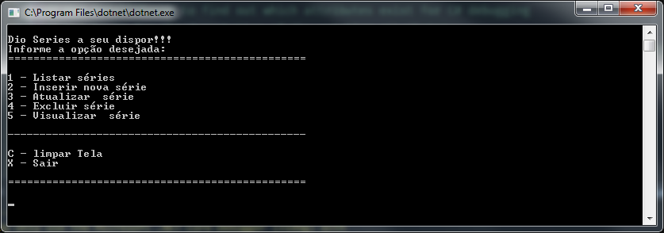

# Bootcamp MRV .NET Developer

## Projeto de CRUD básico para cadastro de Séries

Este projeto foi desenvolvido durante o Bootcamp, teve como desafio desenvolver uma aplicação
básica que fosse capaz de armazenar na mémoria algumas informações sobre séries, onde pude aplicar os conceitos de POO aprendidos até aqui.

### Requisitos

* Windows 7 ou superior
* .NET versão 5.0.103

### Instruções

1. Fazer Downloading do projeto
  <a href="https://github.com/ffsf-filho/squad12/archive/main.zip">Download ZIP</a>
    
    OU
    
    ```git clone  https://github.com/ffsf-filho/dio-series.git```
2. Descompactar o projeto
3. Acessar o prompt de comando, para ir até a paste do projeto
4. Executar o comando de build do dotnet
   ```
   dotnet build
   ```
5. Executar o programa
   ```
   dotnet run
   ```
6. Começe Inserindo uma nova série, veja as opções no menu da aplicação.
